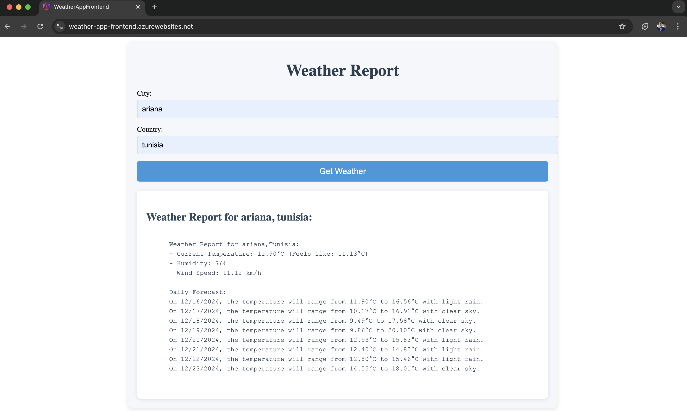

# About the project: 

This is a weather forecasting application that retrieves weather data for a given city name using the [OpenWeather API](https://openweathermap.org/).

This repository includes the source code for the Frontend tier of this application, written in **Angular**.

# Related repositories : 
- [Backend (NestJS)](https://github.com/AchourOussama/weather-app-nestjs)
- [Infrastructure (Azure with Terraform )](https://github.com/AchourOussama/weather-app-infra) 

# Technologies: 
- **Angular:** A TypeScript-based single-page web application framework
- **Docker:** For containerizing the application to ensure consistency across environments.
- **Jenkins:** For automating the build, and deployment pipelines.

# Demonstration: 

